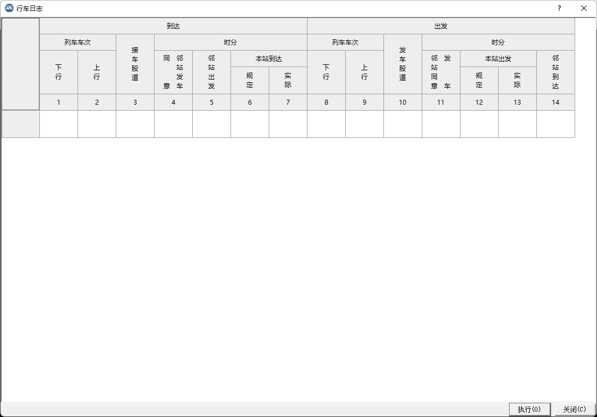

# railroad-onduty
铁路值班员模拟考核系统，从一辆列车的行车计划开始，到进站、开放进路、出站整个过程，考核值班员要做的每一个步骤，联系的每一个人，要做的每一个登记，所有的步骤都会被记录下来并打分，自动形成考核表，全程语音操作。

## 开发环境
1. 开发语言：QT, C/C++
2. 运行环境：Windows, Mac OS, Linux

## 系统功能
1. 自定义车辆行车计划
2. 自定义站点地图
3. 集成科大讯飞语音引擎，各个角色可自定义声音
4. 完全仿真模拟值班员的工作环境，包括电话、占线版、行车计划、检查表、调度命令、考核单等等
5. 全程语音操作
6. 可模拟各种科目考核，也可以自定义科目考核内容
7. 值班员在考核过程中的每一步都将被记录并形成检查成绩表
8. 每一步都有打分，自动记录值班员的错误操作

## 系统截图
主界面

站场联锁模拟仿真端

考核成绩表

行车日志

调度命令

行车设备检查登记簿

占线板

## 联系我们
QQ：81224865
邮箱：[tiger.hu.liu@gmail.com](mailto:tiger.hu.liu@gmail.com)
